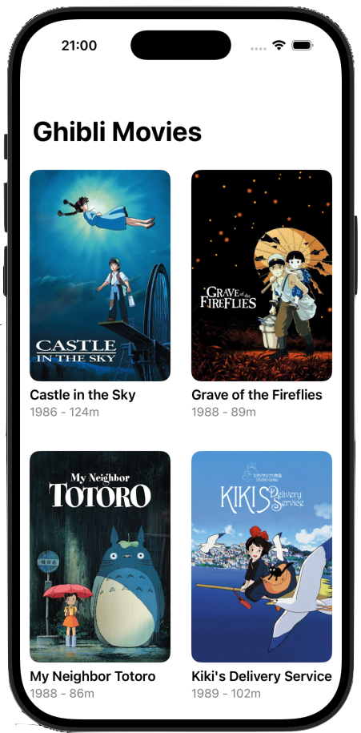
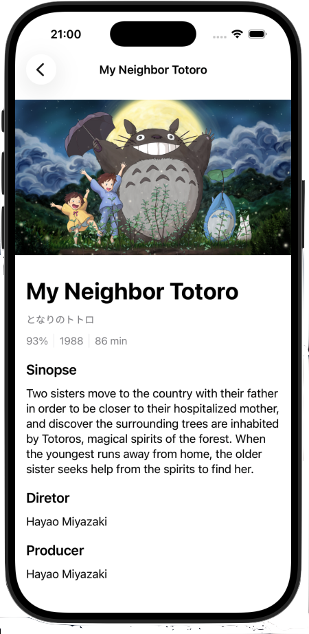
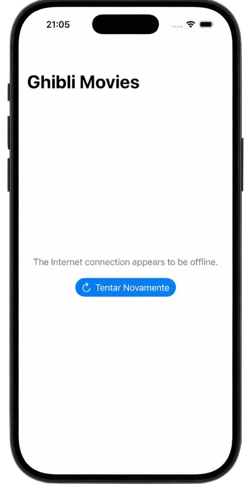

### StudioGlibliNewFeatures 🎬
Um aplicativo iOS nativo desenvolvido para o Desafio Técnico, focado em exibir o catálogo de filmes do Studio Ghibli consumindo a Studio Ghibli API.

## 📱 Visual do Projeto

### 🎬 Catálogo e Interação
A jornada do utilizador consiste na exploração do catálogo completo de obras do Studio Ghibli, com transições fluidas para os detalhes de cada filme e feedback visual claro em caso de falhas de rede.

| Lista de Filmes | Detalhes da Obra | Tratamento de Erros |
|:---:|:---:|:---:|
|  |  |  |
| **Catálogo Assíncrono** | **Informações Detalhadas** | **Feedback Visual (Retry)** |

---

## ⚙️ Funcionalidades
* Listagem completa de filmes do Studio Ghibli.
* Tela de detalhes com informações aprofundadas (diretor, produtor, ano de lançamento, descrição).
* Tratamento de estados visuais (Loading, Success, Error com opção de Retry).

## 🏗️ Arquitetura Escolhida
O projeto foi desenvolvido utilizando o padrão **MVVM (Model-View-ViewModel)** com um fluxo de dados reativo via SwiftUI. 
* A interface (View) reage automaticamente às mudanças de estado publicadas pela ViewModel.
* A lógica de apresentação e o gerenciamento de estados (`.loading`, `.success`, `.error`) estão totalmente isolados na ViewModel, garantindo que as Views fiquem limpas e focadas apenas na renderização visual.

## 🛠️ Decisões Técnicas
* **Injeção de Dependência e Protocolos:** Criei o `MovieServiceProtocol` para abstrair a camada de rede. Isso permitiu criar um `MockMovieService` e testar a lógica da ViewModel de forma isolada, sem depender de requisições reais à internet.
* **Concorrência Moderna:** Utilização extensiva de `async/await` e isolamento de atores (`@MainActor`) para garantir que as atualizações de interface ocorram na thread principal de forma segura e legível.
* **Testes Unitários:** Implementação de testes automatizados (Arrange, Act, Assert) para validar o comportamento da ViewModel em todos os seus cenários (sucesso, erro e estado inicial).

## 🚀 O que faria diferente com mais tempo
* **Cache de Imagens:** Implementação de um sistema de cache local para as capas dos filmes. Isso evitaria downloads repetidos durante o scroll da lista, otimizando o uso de bateria e dados móveis.
* **Paginação (Infinite Scroll):** Preparação da arquitetura para carregar dados em lotes, garantindo performance mesmo em catálogos com centenas de itens.
* **Testes de UI:** Adição de testes automatizados de interface para garantir que a navegação e a apresentação visual funcionam corretamente na perspetiva do utilizador final.

## 📊 Processo de Desenvolvimento
O desenvolvimento foi guiado pela criação de Issues no GitHub para garantir rastreabilidade. Clique nos links abaixo para ver os detalhes de cada etapa:

* **Configuração Inicial:** [#1](https://github.com/jplima30/ghiblimovies/issues/1) - Estrutura base e arquitetura de pastas.
* **Interface Visual:** [#3](https://github.com/jplima30/ghiblimovies/issues/3) e [#18](https://github.com/jplima30/ghiblimovies/issues/18) - Componente de card e refinamento de metadados.
* **Navegação e Detalhes:** [#8](https://github.com/jplima30/ghiblimovies/issues/8) - Fluxo de navegação e tela de detalhes.
* **Refatoração e Estados:** [#15](https://github.com/jplima30/ghiblimovies/issues/15) e [#21](https://github.com/jplima30/ghiblimovies/issues/21) - ViewState, Pull-to-refresh e tratamento de erros.
* **Arquitetura e Testes:** [#22](https://github.com/jplima30/ghiblimovies/issues/22) - Injeção de dependência e testes unitários da ViewModel.

## 💻 Como executar o projeto
1. Clone este repositório: `git clone https://github.com/jplima30/ghiblimovies.git`
2. Abra o arquivo `GhibliMovies.xcodeproj` no Xcode 16+.
3. Selecione um simulador (ex: iPhone 15 Pro) e pressione `Cmd + R`.
